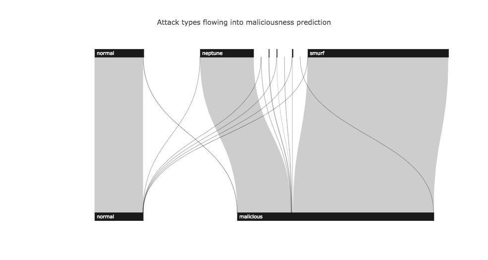

DeepIDS
===
An intrusion detection system built on deep learning.

Purpose
---
As it stands, this project is intended to be a proof-of-value for an intrusion detection system, and not an intrusion prevention system.  Further work could extend this project to an IPS or a near-realtime IDS using a high-performance, distributed computing environment.

Data
---
We've used the KDDCup99 dataset from [OpenML.org](https://www.openml.org/d/1110).  There are several known issues surrounding this dataset; please see the `data/README.md` file for more information.

Approach
---
We trained three neural networks, as well as a logistic regression classifier for stacking.  All models were built with Keras running on Tensorflow.  The architectures can be found in each network's respective development notebook in `develop/`.  We trained each model using the Adam optimizer with a batch size of 32 and Keras defaults for beta hyperparameters.  We also used early stopping monitoring validation accuracy with a patience of three epochs. Other hyperparameters differed for each model, and are shown below:

|  | ReLU | SELU | ResNet | Stacker |
| -------- | ---- | ---- | ------ | ------- |
| Optimized Parameters | 11,030,551 | 8,632,983 | 19,846,551 | 1,587 |
| Dropout |  |  | 0.2 |  |
| BatchNorm | Yes |  | Yes |  |
| Learning Rate | .001 | .00002 | .001 | .00002 |

Preliminary Results
---
We monitored validation accuracy to checkpoint the best model from each training run, then chose the best model with respect to validation accuracy for each architecture from all of our training runs.  Note that in general, it is not advisable to use accuracy when working with a highly imbalanced dataset like KDDCup99.  However, since we are using an ensemble, we want to encourage the base models to develop their own strengths and weaknesses.  Using accuracy as a model selection criterion allows for this by ignoring the class imbalance in its selection process.

|  | ReLU | SELU | ResNet | Ensemble |
| -------- | ---- | ---- | ------ | ------- |
| Training | 0.99858 | 0.99891 | 0.99195 | 0.99945 |
| Validation | 0.99857 | 0.99889 | 0.99195 | 0.99943 |
| Test | 0.99206 | 0.99780 | 0.99319 | 0.99819 |

Below are our results on the test set.  Binary results are determined by converting the problem to a binary classification problem of normal vs. malicious connection attempts.  We've included a standard softmax classifier as a baseline.

|  | Baseline | DeepIDS |
| ----- | ----- | ----- |
| 23-class Accuracy | 0.99551 | 0.99819 |
| Binary Precision | 1.0 | 0.99857 |
| Binary Recall | 0.5 | 0.99974 |

Here are the binary results by class.  See [our blog post](http://blog.pandata.co) for an interactive version.

Next Steps
---
We were unaware of the existence of an updated intrusion detection benchmarking dataset until the end of this project.  Now that we know that NSL-KDD exists, we will be reiterating our method on it.  We will then perform a more complete literature search and compare our method with state of the art results.  Stay tuned!
